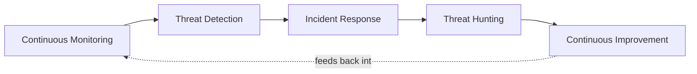
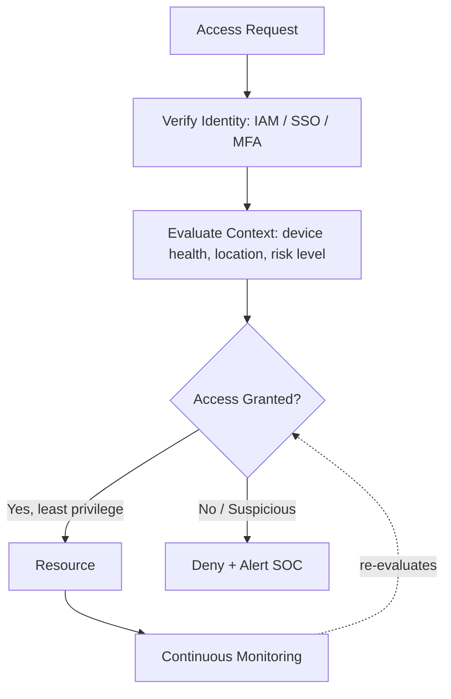

# AI in Cybersecurity: Threat Detection, Security Operations, and Emerging Risks

**Type:** Independent Technical Report
**Author:** Riya Soy
**Date:** August 2026

---

## Abstract

Artificial Intelligence is reshaping cybersecurity on both sides of the fight — strengthening threat detection, intrusion detection systems (IDS), and security operations centers (SOC), while simultaneously giving attackers new tools such as AI-generated phishing, deepfakes, and adversarial attacks on ML models themselves. This report surveys how AI is applied across the detection-response lifecycle, reviews the NIST Cybersecurity Framework and Zero Trust as structuring models, and examines AI-specific risks — adversarial attacks, data poisoning, and model drift — that undermine the reliability of AI-driven defenses. It closes with an outlook on autonomous SOCs and the continued need for human oversight.

**Keywords:** AI in Cybersecurity, Threat Detection, SOC, IDS, NIST CSF, Zero Trust, Adversarial AI, Data Poisoning, Model Drift

---

## Table of Contents

1. [Introduction](#1-introduction)
2. [What is Cybersecurity?](#2-what-is-cybersecurity)
3. [AI in Cybersecurity](#3-ai-in-cybersecurity)
4. [Intrusion Detection Systems (IDS)](#4-intrusion-detection-systems-ids)
5. [Security Operations Centers (SOC)](#5-security-operations-centers-soc)
6. [NIST Cybersecurity Framework](#6-nist-cybersecurity-framework)
7. [Zero Trust Security](#7-zero-trust-security)
8. [Adversarial AI Attacks](#8-adversarial-ai-attacks)
9. [Data Poisoning](#9-data-poisoning)
10. [Model Drift](#10-model-drift)
11. [Broader Cybersecurity Frameworks](#11-broader-cybersecurity-frameworks)
12. [Future of AI in Cybersecurity](#12-future-of-ai-in-cybersecurity)
13. [Conclusion](#13-conclusion)
14. [References](#14-references)

---

## 1. Introduction

Cybersecurity has become one of the most important challenges of the digital age. Governments, businesses, and individuals increasingly rely on interconnected networks, cloud services, digital platforms, and smart technologies to store information, conduct operations, and deliver essential services. While digital transformation has created significant opportunities for innovation and efficiency, it has also expanded the attack surface available to cybercriminals.

Modern cyber threats have evolved far beyond traditional computer viruses. Organizations today face a wide range of risks, including ransomware attacks, phishing campaigns, data breaches, identity theft, supply chain compromises, and attacks targeting critical infrastructure. The increasing sophistication of these threats has made cybersecurity a strategic priority rather than merely a technical concern.

At the same time, Artificial Intelligence (AI) is transforming the cybersecurity landscape. AI-powered systems can analyze vast amounts of security data, detect anomalies, automate routine tasks, and respond to threats at a speed that would be impossible through manual processes alone. As a result, organizations are increasingly adopting AI-driven security solutions to strengthen their defenses and improve operational efficiency.

However, AI is also creating new challenges. Cybercriminals are leveraging AI technologies to develop more sophisticated phishing attacks, generate malicious code, create convincing deepfakes, and automate cyberattacks at scale. This has created an ongoing technological competition between defenders seeking to enhance security and attackers attempting to exploit emerging technologies.

This report explores the role of Artificial Intelligence in modern cybersecurity. It examines how AI is being used to improve threat detection, incident response, and security operations while also analyzing the risks associated with AI-powered cyber threats. It further discusses key cybersecurity frameworks, emerging challenges such as adversarial AI attacks and data poisoning, and the future of AI-driven cybersecurity in an increasingly connected world.

## 2. What is Cybersecurity?

Cybersecurity is the practice of protecting computer systems, networks, devices, applications, and data from unauthorized access, cyberattacks, and digital threats. Its primary objective is to ensure the confidentiality, integrity, and availability of information while safeguarding individuals and organizations from financial, operational, and reputational damage.

As businesses, governments, and individuals increasingly depend on digital technologies, cybersecurity has become a critical component of modern risk management. Cyber threats such as malware, ransomware, phishing attacks, data breaches, identity theft, and distributed denial-of-service (DDoS) attacks continue to grow in both frequency and sophistication.

An effective cybersecurity strategy combines people, processes, and technology to identify vulnerabilities, prevent attacks, detect suspicious activities, and respond to security incidents. Modern cybersecurity practices extend beyond protecting traditional networks and devices to securing cloud environments, digital services, critical infrastructure, and emerging technologies such as Artificial Intelligence.

In today's interconnected world, cybersecurity is not only a technical requirement but also a strategic necessity for ensuring business continuity, protecting sensitive information, and maintaining public trust in digital systems.

## 3. AI in Cybersecurity

### 3.1 What is AI in Cybersecurity?

Artificial Intelligence in cybersecurity refers to the use of machine learning, data analytics, and other AI technologies to enhance the detection, prevention, and response to cyber threats. By analyzing massive volumes of security data in real time, AI can identify patterns, detect anomalies, automate routine tasks, and support security professionals in making faster and more informed decisions.

Traditional cybersecurity tools often rely on predefined rules and known attack signatures. While effective against familiar threats, these approaches can struggle to detect new and evolving attack techniques. AI addresses this challenge by continuously learning from data, enabling security systems to identify suspicious behavior, uncover hidden threats, and respond to incidents more efficiently.

AI is used across multiple areas of cybersecurity. In identity and access management, it analyzes user behavior to detect unusual login activities and potential account compromises. In endpoint security, AI helps identify malware and suspicious activities on devices connected to a network. Cloud security platforms use AI to monitor risks across complex cloud environments, while data security solutions leverage AI to classify sensitive information and detect unauthorized access attempts.

One of the most significant applications of AI is cyber threat detection and response. AI-powered systems such as Security Information and Event Management (SIEM) and Extended Detection and Response (XDR) platforms analyze data from endpoints, networks, emails, cloud services, and user accounts to identify potential threats. These systems can correlate security events, prioritize critical alerts, and provide actionable insights to security teams.

AI also enhances incident investigation and response by helping analysts process large volumes of security data more quickly. Generative AI tools can summarize incidents, answer investigative questions, and translate complex technical findings into understandable language, enabling faster decision-making during cyber incidents.

### 3.2 Why Organizations Use AI for Security

Organizations are adopting AI-driven security solutions because traditional cybersecurity tools often struggle to keep pace with the scale, speed, and complexity of modern cyber threats. Security teams must analyze massive volumes of logs, network traffic, user activity, and threat intelligence data every day. AI enables organizations to process this information rapidly and identify threats that may otherwise go unnoticed.

One of the primary advantages of AI is its ability to establish a baseline of normal behavior and detect anomalies in real time. By continuously monitoring systems, networks, and user activities, AI can identify suspicious patterns that may indicate malware infections, insider threats, account compromises, or data breaches.

AI also improves operational efficiency by automating routine security tasks such as alert triage, log analysis, threat classification, and incident investigation. This reduces the workload on security analysts and allows them to focus on higher-priority threats and strategic decision-making.

In addition, AI enhances predictive capabilities by analyzing historical attack data and identifying emerging threat trends. Organizations can use these insights to proactively strengthen defenses before attacks occur. Studies have shown that organizations utilizing AI-powered security and automation tools can detect and contain security incidents significantly faster than those relying solely on traditional methods.

### 3.3 AI for Threat Detection

Threat detection is one of the most significant applications of Artificial Intelligence in cybersecurity. Modern organizations generate enormous amounts of security data from endpoints, networks, cloud environments, applications, and user activities. AI enables security teams to continuously analyze this data and identify suspicious behavior that may indicate an ongoing cyberattack.

Machine learning algorithms establish behavioral baselines for users, devices, and networks. When unusual activity occurs — such as abnormal login attempts, unexpected data transfers, or suspicious network traffic — the system can automatically flag the event for investigation. This approach is particularly valuable for identifying previously unknown threats and zero-day attacks that may bypass traditional signature-based security tools.

AI-powered threat detection systems are commonly integrated into technologies such as SIEM, XDR, and Endpoint Detection and Response (EDR) platforms.

**Key applications:**

| Application | What it does |
|---|---|
| Behavioral Analytics | Identifies unusual user or system activities that may indicate malicious behavior |
| Anomaly Detection | Detects deviations from normal network and system behavior |
| SIEM / XDR Integration | Correlates security events from multiple sources to improve visibility and response |
| Alert Prioritization | Reduces false positives and helps analysts focus on high-risk threats |
| Incident Investigation | Provides actionable insights and contextual information during investigations |

Generative AI is also increasingly used to assist security teams during investigations — summarizing incidents, explaining attack patterns in natural language, recommending mitigation steps, and accelerating decision-making during active security events. By improving visibility, reducing false positives, and enabling faster identification of malicious activities, AI-powered threat detection has become a critical component of modern cybersecurity operations.

### 3.4 AI for Malware Detection

Traditional malware detection relies heavily on signature-based methods that compare files against databases of known malicious code. While effective against previously identified threats, these approaches often struggle to detect new and rapidly evolving malware variants designed to evade conventional security tools.

Artificial Intelligence has significantly improved malware detection by shifting the focus from static signatures to behavioral analysis. Instead of searching only for known malware patterns, AI systems examine how files, applications, and processes behave to identify indicators of malicious activity.

**How AI improves malware detection:**

- **Behavioral Analysis** — detects suspicious activities rather than relying solely on known signatures.
- **Anomaly Detection** — identifies deviations from normal system behavior that may indicate infection.
- **Zero-Day Detection** — helps uncover previously unknown malware variants.
- **Automated Classification** — rapidly analyzes and categorizes suspicious files.
- **Ransomware Detection** — identifies ransomware behavior before significant damage occurs.
- **Threat Triage** — prioritizes and investigates malware-related alerts more efficiently.

One example is IBM's AI-powered security solutions, which use anomaly-based detection to establish a baseline of normal system behavior; any deviation from this baseline can be flagged as a potential threat, enabling detection of zero-day attacks and previously unknown malware. Emerging agentic AI approaches further enhance detection by breaking complex security investigations into smaller reasoning steps, improving analytical accuracy and response efficiency.

### 3.5 AI-Powered Cyber Threats

While Artificial Intelligence strengthens cybersecurity defenses, it also provides new capabilities for cybercriminals. Generative AI tools, large language models (LLMs), and deepfake technologies have lowered the technical barriers required to launch sophisticated cyberattacks.

**AI-Powered Phishing Attacks**
AI-powered phishing attacks use generative AI to create highly personalized and convincing messages that closely resemble legitimate communications. By analyzing publicly available information, attackers can generate context-aware emails, messages, and social engineering campaigns at a scale that was previously impossible. These attacks are harder to detect because AI can produce grammatically correct, professional-looking content that mimics human communication patterns.

**Deepfakes and Social Engineering**
Deepfakes are AI-generated audio, video, or image content designed to imitate real individuals. In cybersecurity, deepfakes pose significant risks because they can be used to impersonate executives, employees, public officials, or trusted contacts. Attackers have used deepfake technology to conduct financial fraud, bypass identity verification processes, and manipulate employees into disclosing sensitive information. Business Email Compromise (BEC) schemes have become increasingly sophisticated through the use of AI-generated voices and video calls.

**AI-Generated Malware**
AI-generated malware refers to malicious software whose development is assisted by generative AI systems. These tools can help attackers write code, modify malware variants, automate exploitation techniques, and evade traditional signature-based detection methods. Because AI can rapidly generate new malware variations, cybersecurity teams face greater challenges in identifying and mitigating threats using conventional security approaches.

The rise of AI-powered cyber threats demonstrates that artificial intelligence is simultaneously a defensive and offensive technology — as organizations adopt AI-based security tools, attackers are also leveraging AI to increase the scale, speed, and sophistication of cyberattacks.

## 4. Intrusion Detection Systems (IDS)

### 4.1 What is an IDS?

An Intrusion Detection System (IDS) is a cybersecurity technology designed to monitor network traffic, system activities, and user behavior to identify malicious actions, policy violations, or suspicious events. Rather than actively blocking attacks, an IDS functions as a monitoring and alerting system that helps security teams detect threats and respond before significant damage occurs.

IDS solutions play a critical role in modern cybersecurity because organizations generate massive volumes of network traffic and security events every day. Manually identifying malicious activities within this data is often impossible, making automated detection systems essential.

### 4.2 Types of Intrusion Detection Systems

Most IDS solutions use one of two primary detection methods:

- **Signature-Based Detection** — compares network traffic and system activities against a database of known attack signatures, malware fingerprints, and threat patterns. Highly effective for previously identified threats, but may struggle with new or unseen ones.
- **Anomaly-Based Detection** — establishes a baseline of normal network and system behavior using statistical analysis or machine learning, flagging significant deviations as suspicious. Particularly valuable for zero-day attacks, insider threats, and novel attack patterns.

### 4.3 The Role of AI in IDS

Artificial Intelligence has significantly enhanced the capabilities of modern Intrusion Detection Systems. Traditional IDS platforms often rely on predefined rules and signatures, which can be ineffective against rapidly evolving cyber threats. AI enables IDS solutions to continuously learn from data and adapt to changing attack techniques.

**Key benefits of AI-powered IDS:**

- **Behavioral Analysis** — identifies unusual user and network behaviors that may indicate compromised accounts or malicious activity.
- **Predictive Threat Detection** — machine learning models analyze historical attack patterns and threat intelligence to anticipate emerging risks.
- **Adaptive Learning** — AI systems continuously improve detection accuracy as they process new data.
- **Scalability** — AI can analyze millions of security events across cloud, on-premises, and hybrid environments.
- **Reduced False Positives** — intelligent filtering helps security teams focus on genuine threats.

### 4.4 Challenges and Limitations

Despite its advantages, IDS technology is not perfect. Signature-based systems can miss previously unknown threats, while anomaly-based systems may generate false positives if normal behavior patterns change unexpectedly. AI-powered IDS solutions also require high-quality data and continuous monitoring to maintain accuracy and effectiveness.

### 4.5 Importance in Modern Cybersecurity

As cyberattacks become increasingly sophisticated, organizations require faster and more intelligent methods of detecting threats. Modern attacks such as ransomware, AI-generated phishing campaigns, and zero-day exploits can spread rapidly across networks. AI-enhanced IDS solutions provide organizations with greater visibility, faster threat detection, and improved incident response capabilities, making them a critical component of contemporary cybersecurity strategies.

## 5. Security Operations Centers (SOC)

### 5.1 What is a SOC?

A Security Operations Center (SOC) is a centralized unit responsible for continuously monitoring, detecting, analyzing, and responding to cybersecurity threats across an organization's digital infrastructure. SOC teams operate as the frontline defense against cyberattacks, helping organizations protect networks, devices, cloud environments, applications, and sensitive data.

Modern organizations generate thousands of security events every day. Without a dedicated security operations team, identifying genuine threats among large volumes of activity would be extremely difficult.

### 5.2 Why SOCs Matter

Cyberattacks have become increasingly sophisticated, frequent, and costly. Ransomware attacks, phishing campaigns, insider threats, and supply chain compromises can disrupt business operations and cause significant financial and reputational damage. Security Operations Centers help organizations:

- Detect threats before they cause major damage
- Reduce incident response times
- Improve organizational resilience
- Strengthen overall cybersecurity posture
- Maintain business continuity during security incidents

### 5.3 Core Functions of a SOC

- **Continuous Monitoring** — SOC teams collect and analyze security data from firewalls, endpoints, servers, cloud platforms, and security tools to identify suspicious activities and emerging risks.
- **Threat Detection** — analysts use threat intelligence, security analytics platforms, and automated detection tools to identify malicious activities.
- **Incident Response** — when suspicious activity is detected, SOC teams investigate, determine severity, isolate affected systems, and coordinate remediation.
- **Threat Hunting** — analysts proactively search for hidden threats and indicators of compromise that may have evaded automated detection.
- **Continuous Improvement** — following incidents, teams review lessons learned, update detection rules, and refine response procedures.

### 5.4 Types of Security Operations Centers

- **In-House SOC** — a dedicated internal team manages security operations using the organization's own personnel and infrastructure.
- **Managed SOC** — monitoring and incident response are outsourced to a Managed Security Service Provider (MSSP).
- **Hybrid SOC** — a combination of internal staff and external providers, balancing strategic control with external expertise.

### 5.5 Role of SOC Analysts

SOC analysts are responsible for monitoring alerts, investigating suspicious activities, and responding to potential threats. Responsibilities include monitoring security dashboards, investigating incidents, conducting threat hunting, analyzing malware and attack techniques, coordinating response efforts, and documenting security events.

### 5.6 How AI Improves SOC Operations

- **Intelligent Alert Prioritization** — AI filters and prioritizes alerts based on risk levels, helping analysts focus on critical threats.
- **Automated Investigation** — AI rapidly analyzes large volumes of security data and correlates related events to identify attacks.
- **Faster Incident Response** — AI-powered systems can recommend or automate containment actions to reduce response times.
- **Predictive Threat Intelligence** — machine learning models analyze historical attack data and emerging trends to anticipate future risks.
- **Reduced Analyst Burnout** — AI reduces alert fatigue by eliminating many false positives and repetitive investigative tasks.

### 5.7 Generative AI in SOCs

Generative AI acts as a force multiplier by assisting analysts throughout the security lifecycle, including rapid alert summarization, natural language querying of security data, AI-guided incident investigations, automated report generation, threat hunting assistance, and knowledge support for junior analysts.

### 5.8 Challenges Faced by SOC Teams

Despite technological advances, SOC teams continue to face large volumes of security alerts, false positives and alert fatigue, a shortage of skilled cybersecurity professionals, increasing complexity of cyberattacks, and high operational and staffing costs — challenges that are among the primary drivers of AI adoption in security operations.

### 5.9 Future of AI-Powered SOCs

The future SOC is expected to become increasingly automated through AI-driven threat detection, autonomous response systems, and advanced security analytics. Human analysts will continue to play a critical role, but AI will increasingly act as a force multiplier, enabling security teams to respond faster and more effectively to evolving cyber threats.

## 6. NIST Cybersecurity Framework

### 6.1 What is the NIST Cybersecurity Framework?

The NIST Cybersecurity Framework (NIST CSF) is one of the most widely adopted cybersecurity frameworks in the world. Developed by the National Institute of Standards and Technology, it provides organizations with a structured approach to managing cybersecurity risks and improving overall security posture.

NIST is a non-regulatory agency of the U.S. Department of Commerce that develops standards, guidelines, and best practices to promote innovation and technological advancement. One of the key strengths of the NIST CSF is its flexibility — it can be adopted by organizations of different sizes, industries, and levels of cybersecurity maturity.

### 6.2 Core Structure

- **Functions** — provide high-level cybersecurity outcomes.
- **Categories** — group cybersecurity activities into specific areas.
- **Subcategories** — provide detailed technical and operational objectives.
- **Informative References** — connect framework outcomes to existing standards and best practices.

### 6.3 Core Functions

| Function | Focus |
|---|---|
| **Identify** | Understand assets, systems, data, and cybersecurity risks — asset management, governance, risk assessment, supply chain risk management. |
| **Protect** | Implement safeguards — identity and access management, security awareness training, data security, protective technologies. |
| **Detect** | Identify incidents as quickly as possible — continuous monitoring, anomaly detection, event analysis. |
| **Respond** | Act after detection — incident response planning, communications, mitigation, continuous improvement. |
| **Recover** | Restore operations after an incident — recovery planning, system restoration, business continuity. |

### 6.4 NIST CSF 2.0 and Governance

The latest version of the framework, NIST CSF 2.0, introduces a new **Govern** function that emphasizes cybersecurity governance, leadership oversight, policy development, and risk management — reflecting cybersecurity's growing status as a strategic business issue rather than solely a technical one.

### 6.5 AI and the NIST Cybersecurity Framework

- **Identify** — AI helps analyze assets and discover vulnerabilities across complex environments.
- **Protect** — AI supports identity verification, access control, and automated security policies.
- **Detect** — machine learning algorithms identify anomalies, suspicious behaviors, and emerging threats in real time.
- **Respond** — AI assists by prioritizing alerts, automating investigations, and accelerating incident response.
- **Recover** — predictive analytics help organizations restore systems efficiently and improve resilience.

### 6.6 Importance

The NIST CSF provides a practical, risk-based approach to cybersecurity management. Its flexibility, scalability, and broad adoption make it one of the most influential cybersecurity frameworks in the world, and a natural structure into which AI-driven capabilities can be integrated.

## 7. Zero Trust Security

### 7.1 What is Zero Trust?

Zero Trust is a modern cybersecurity strategy built on the principle of **"Never Trust, Always Verify."** Unlike traditional security models that automatically trust users and devices inside a network perimeter, Zero Trust assumes that every user, device, application, and connection could be compromised and therefore must be continuously verified before being granted access.

As organizations increasingly adopt cloud computing, remote work, and hybrid infrastructures, traditional perimeter-based security models have become less effective — attackers who breach a network can often move laterally with little resistance. Zero Trust addresses this by enforcing strict identity verification and access controls at every stage.

### 7.2 Why Traditional Perimeter Security Is Insufficient

Traditional cybersecurity models focus on defending the network perimeter, assuming that users and devices inside the network can be trusted. However, modern cyber threats frequently originate from compromised accounts, insider threats, stolen credentials, and cloud-based environments where no clear perimeter exists — pushing organizations toward architectures that verify every access request regardless of origin.

### 7.3 Core Principles of Zero Trust

- **Never Trust, Always Verify** — every access request must be authenticated, authorized, and continuously validated; trust is never assumed based on network location alone.
- **Identity Verification** — the foundation of Zero Trust. Common technologies: Identity and Access Management (IAM), Single Sign-On (SSO), Multi-Factor Authentication (MFA), and Conditional Access Policies.
- **Verify Explicitly** — every access request is evaluated using all available signals (identity, device health, location, access history, risk level) rather than assuming trust based on network location.
- **Multi-Factor Authentication (MFA)** — requires verification through multiple factors (passwords, security tokens, mobile authentication apps, biometrics), significantly reducing risk from stolen credentials.
- **Least Privilege Access** — users and applications receive only the minimum access required, reducing attack surface, insider-threat risk, and blast radius if credentials are compromised.
- **Continuous Monitoring** — user behavior, device health, and access patterns are evaluated throughout an active session, not just at login; access can be revoked if suspicious activity is detected.

### 7.4 Microsegmentation

Microsegmentation divides networks into smaller security zones and applies access controls between them. Even if attackers gain access to one segment of the network, their ability to move laterally across systems is significantly restricted.

### 7.5 How AI Supports Zero Trust Security

Artificial Intelligence strengthens Zero Trust architectures by enabling automated and continuous security decisions: behavioral analytics to identify unusual user activity, risk-based authentication that adapts dynamically, real-time anomaly detection, automated threat detection and response, and continuous monitoring of devices and network activity. AI allows organizations to process vast amounts of security data and rapidly identify potential threats that would be difficult for human analysts to detect manually.

### 7.6 Importance of Zero Trust Security

Zero Trust has become one of the most important cybersecurity strategies in modern digital environments. As organizations continue to adopt cloud services, remote work, and AI-powered systems, traditional trust-based security models are becoming increasingly ineffective, making continuous verification and AI-driven monitoring central to a resilient security posture.

## 8. Adversarial AI Attacks

### 8.1 What are Adversarial AI Attacks?

Adversarial AI attacks are deliberate attempts to manipulate, deceive, or exploit machine learning models by feeding them malicious inputs or compromising the training process. These attacks aim to force AI systems to make incorrect decisions, bypass security controls, or reveal sensitive information. Unlike traditional cyberattacks that target software vulnerabilities, adversarial attacks specifically target the behavior and decision-making mechanisms of AI systems.

### 8.2 Types of Adversarial AI Attacks

- **Evasion Attacks** — attackers manipulate input data to fool an AI model during deployment; small, often human-imperceptible modifications can cause misclassification. Examples: bypassing facial recognition, evading AI-powered malware detection, avoiding IDS through modified network traffic.
- **Data Poisoning Attacks** — target the training phase by injecting malicious or misleading data into training datasets, aiming to reduce model accuracy, introduce hidden vulnerabilities, or manipulate future predictions. (Expanded in Section 9.)
- **Model Extraction Attacks** — attempt to reconstruct or replicate an AI model by repeatedly querying it and analyzing its responses, risking theft of intellectual property and increased vulnerability to future attacks.
- **Prompt Injection Attacks** — target generative AI systems by crafting malicious prompts designed to bypass safeguards or manipulate model behavior, potentially causing leakage of sensitive information, circumvention of security controls, and unauthorized system actions.

### 8.3 Risks of Adversarial AI Attacks

Adversarial attacks can undermine the reliability, security, and trustworthiness of AI systems — leading to incorrect decision-making, reduced detection accuracy, security breaches, financial losses, and reputational damage.

### 8.4 Importance in Cybersecurity

As AI becomes increasingly integrated into cybersecurity operations, defending against adversarial attacks has become a critical security challenge. Organizations must continuously test, monitor, and strengthen AI systems to ensure resilience against emerging attack techniques.

## 9. Data Poisoning

### 9.1 What is Data Poisoning?

Data poisoning is a cyberattack in which malicious actors intentionally manipulate datasets used to train or fine-tune AI and machine learning models. By injecting corrupted, false, or biased data into training datasets, attackers can influence model behavior, reduce accuracy, introduce hidden vulnerabilities, or force specific outcomes. Because machine learning systems rely heavily on the quality and integrity of training data, poisoned datasets can compromise an AI model before it is even deployed.

### 9.2 How Data Poisoning Works

Unlike traditional cyberattacks that target deployed systems, data poisoning occurs during the training or fine-tuning stage of the AI lifecycle:

- **Data Injection** — attackers add malicious, misleading, or biased samples directly into training datasets.
- **Data Modification** — existing records, labels, metadata, or features are altered to manipulate model behavior.
- **Data Deletion** — important training samples are removed, creating imbalanced datasets and biased or inaccurate outputs.

### 9.3 Risks of Data Poisoning

Data poisoning can result in reduced model accuracy, biased decision-making, hidden backdoors within AI systems, increased vulnerability to future attacks, and loss of trust in AI-driven decisions. In cybersecurity applications specifically, poisoned models may fail to detect malicious activity or incorrectly classify threats — weakening organizational security at its foundation.

### 9.4 Mitigation Strategies

Organizations can reduce the risk of data poisoning through dataset validation and verification, continuous monitoring of training data quality, use of trusted and verified data sources, regular model testing and auditing, and strong AI governance and security controls.

## 10. Model Drift

### 10.1 What is Model Drift?

Model drift, also known as model decay, refers to the gradual decline in the performance and accuracy of a machine learning model over time. It occurs when real-world conditions change and the data encountered during deployment differs from the data used during training.

### 10.2 Causes of Model Drift

- **Data Drift** — the statistical characteristics of incoming data change over time (e.g., changes in user behavior, new network traffic patterns, emerging cybersecurity threats, shifts in business operations).
- **Concept Drift** — the relationship between inputs and expected outcomes changes; for example, cybercriminals continuously develop new attack techniques, making older threat detection models less effective.
- **Environmental Changes** — changes in infrastructure, regulations, technologies, or organizational processes can also impact model performance.

### 10.3 Impact on Cybersecurity Systems

Model drift can increase false positives and false negatives, reduce threat detection accuracy, create security blind spots, and weaken automated decision-making. Without proper monitoring, organizations may unknowingly rely on outdated AI models that no longer reflect current threat landscapes.

### 10.4 Managing Model Drift

Organizations can address model drift through continuous monitoring of model performance, regular retraining using updated datasets, automated performance testing, human oversight and validation, and periodic security reviews.

### 10.5 Importance of Model Monitoring

Cyber threats evolve rapidly, making continuous model monitoring a critical component of AI-powered cybersecurity. Maintaining accurate, up-to-date models helps ensure security systems remain effective, reliable, and resilient against emerging threats.

## 11. Broader Cybersecurity Frameworks

### 11.1 What is a Cybersecurity Framework?

A cybersecurity framework is a structured set of guidelines, standards, and best practices that organizations use to manage, mitigate, and reduce cyber risks. Frameworks provide a standardized approach for identifying vulnerabilities, protecting critical assets, responding to security incidents, and improving overall cybersecurity resilience.

### 11.2 Why Organizations Use Cybersecurity Frameworks

Frameworks help organizations identify and assess security risks, protect critical systems and sensitive data, detect threats and incidents, respond effectively to attacks, recover from disruptions, demonstrate regulatory compliance, and establish consistent security policies — replacing ad-hoc security measures with a structured, repeatable approach.

### 11.3 Major Cybersecurity Frameworks

| Framework | Focus |
|---|---|
| **NIST AI Risk Management Framework (AI RMF)** | Identifies, assesses, and manages risks specific to AI systems — trustworthiness, governance, transparency, privacy, security. |
| **ISO/IEC 27001** | Internationally recognized standard for establishing, implementing, and maintaining an Information Security Management System (ISMS); certifiable. |
| **CIS Controls** | Prioritized, actionable best practices from the Center for Internet Security, focused on practical defense against common threats. |
| **HITRUST CSF** | Designed for highly regulated industries (healthcare, financial services); integrates multiple security/privacy standards into one framework. |
| **MITRE ATT&CK** | A globally recognized knowledge base of adversarial tactics, techniques, and procedures (TTPs), used to understand attacker behavior and evaluate defenses. |

### 11.4 Role of AI in Cybersecurity Frameworks

AI supports framework implementation by automating threat detection and monitoring, identifying security vulnerabilities, analyzing large volumes of security data, prioritizing alerts, supporting compliance monitoring, and enhancing incident response capabilities.

### 11.5 Importance

Cybersecurity frameworks provide a foundation for building resilient security programs, helping organizations establish clear objectives, implement best practices, manage risk systematically, and adapt to emerging threats — including those introduced by AI itself.

## 12. Future of AI in Cybersecurity

Artificial Intelligence is expected to play an increasingly important role in cybersecurity as organizations face a growing number of sophisticated and rapidly evolving cyber threats. Traditional security tools often struggle to process the enormous volume of security data generated by modern networks, making AI-driven solutions essential for improving threat detection, response, and risk management.

One of the most significant developments is the rise of autonomous security operations. AI-powered SOCs can analyze millions of security events in real time, prioritize alerts, automate investigations, and assist analysts in responding to incidents more efficiently. Future AI systems may be capable of automatically isolating compromised devices, blocking malicious activities, and initiating remediation actions with minimal human intervention.

Predictive cybersecurity is another emerging trend. By analyzing historical threat intelligence, user behavior patterns, and network activity, AI systems can identify vulnerabilities and predict potential attack paths before they are exploited — enabling a proactive rather than reactive defensive posture.

Generative AI is also transforming cybersecurity operations. Security professionals can use large language models to summarize incident reports, assist with threat hunting, generate security documentation, and simplify complex investigations. However, cybercriminals are also leveraging generative AI to develop more convincing phishing campaigns, automate malware development, and create highly realistic deepfakes — increasing the sophistication of cyber threats on the offensive side as well.

The adoption of AI within cloud security, identity management, and Zero Trust architectures is expected to accelerate, with AI continuously monitoring user behavior, detecting anomalies, and dynamically adjusting access permissions based on risk levels.

Despite these advantages, the future of AI in cybersecurity presents new challenges. Organizations must address adversarial AI attacks, data poisoning, model drift, privacy risks, and overreliance on automated decision-making. Human oversight will remain essential to ensure AI-driven security systems operate accurately, ethically, and transparently.

Ultimately, the future of cybersecurity will likely involve close collaboration between human analysts and AI systems — AI enhancing analyst capabilities rather than replacing them, enabling faster threat detection, more effective incident response, and stronger protection against increasingly complex cyber threats.

## 13. Conclusion

Artificial Intelligence is rapidly transforming the cybersecurity landscape by enabling faster threat detection, automated incident response, and more proactive security operations. As cyber threats continue to grow in scale and sophistication, traditional security approaches are increasingly being supplemented by AI-driven technologies capable of analyzing vast amounts of data in real time.

This report explored the foundations of cybersecurity, the role of AI in modern security operations, and key applications such as threat detection, malware analysis, intrusion detection systems, and security operations centers. It also examined emerging challenges — adversarial AI attacks, data poisoning, and model drift — that highlight the risks of relying on AI systems without proper safeguards, and reviewed structuring frameworks including the NIST Cybersecurity Framework and Zero Trust Security.

While AI offers significant advantages in improving cybersecurity capabilities, it is not a complete replacement for human expertise. Effective cybersecurity requires a combination of skilled professionals, robust governance frameworks, secure system design, and continuous monitoring. Organizations that successfully integrate AI-driven security with strong governance, risk management, and ethical practices will be better positioned to defend against the next generation of cyber threats.

## 14. References

**Cybersecurity Fundamentals**
1. CISA — [What is Cybersecurity?](https://www.cisa.gov/news-events/news/what-cybersecurity)
2. Microsoft Security — [What is Cybersecurity?](https://www.microsoft.com/en-us/security/business/security-101/what-is-cybersecurity)
3. Cisco — [What is Cybersecurity?](https://www.cisco.com/site/in/en/learn/topics/security/what-is-cybersecurity.html)
4. IBM — [Cybersecurity Overview](https://www.ibm.com/think/topics/cybersecurity)
5. NCSC UK — [What is Cyber Security?](https://www.ncsc.gov.uk/section/about-ncsc/what-is-cyber-security)

**AI in Cybersecurity**
6. Microsoft Security — [AI for Cybersecurity](https://www.microsoft.com/en-us/security/business/security-101/what-is-ai-for-cybersecurity)
7. IBM — [AI Security](https://www.ibm.com/think/topics/ai-security)

**Cybersecurity Frameworks**
8. NIST — [Cybersecurity Framework (CSF 2.0)](https://www.nist.gov/cyberframework)
9. IBM — [NIST Cybersecurity Framework Explained](https://www.ibm.com/think/topics/nist)
10. ISO — [ISO/IEC 27001 Information Security Standard](https://www.iso.org/isoiec-27001-information-security.html)
11. CIS — [CIS Controls](https://www.cisecurity.org/controls)
12. MITRE — [ATT&CK Framework](https://attack.mitre.org)

**Zero Trust Security**
13. IBM — [Zero Trust Security](https://www.ibm.com/think/topics/zero-trust)
14. Microsoft — [Zero Trust Architecture](https://www.microsoft.com/en-us/security/business/zero-trust)

**Security Operations and Threat Detection**
15. Microsoft — [Security Copilot](https://www.microsoft.com/en-us/security/business/ai-machine-learning/microsoft-security-copilot)
16. CrowdStrike — [AI-Powered Threat Detection](https://www.crowdstrike.com)
17. IBM — [Security Intelligence](https://www.ibm.com/security)

**AI Security and Adversarial AI**
18. NIST — [AI Risk Management Framework (AI RMF)](https://www.nist.gov/itl/ai-risk-management-framework)
19. OWASP — [Top 10 for Large Language Model Applications](https://owasp.org/www-project-top-10-for-large-language-model-applications/)
20. MITRE — [ATLAS](https://atlas.mitre.org)

---

*All notes and summaries in this report were compiled from publicly available resources, official cybersecurity guidance, industry reports, and documentation published by CISA, NIST, Microsoft, IBM, Cisco, MITRE, CIS, ISO, CrowdStrike, OWASP, and NCSC UK.*
